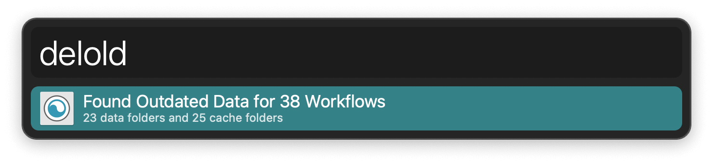

#  Clean Workflow Data Alfred Workflow

Trash Data and Cache folders of uninstalled workflows

[⤓ Install on the Alfred Gallery](https://alfred.app/workflows/alfredapp/clean-workflow-data)

## Usage

Find data and cache folders from uninstalled workflows via the `delold` keyword.

* <kbd>↩&#xFE0E;</kbd> Trash found folders.
* <kbd>⌘</kbd><kbd>↩&#xFE0E;</kbd> Copy folder paths to clipboard.
